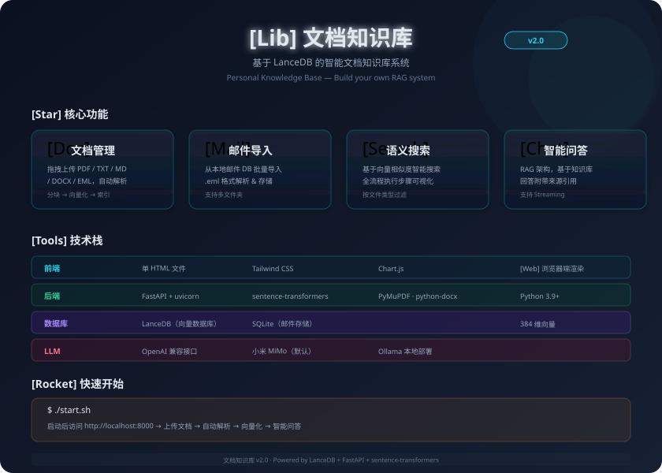
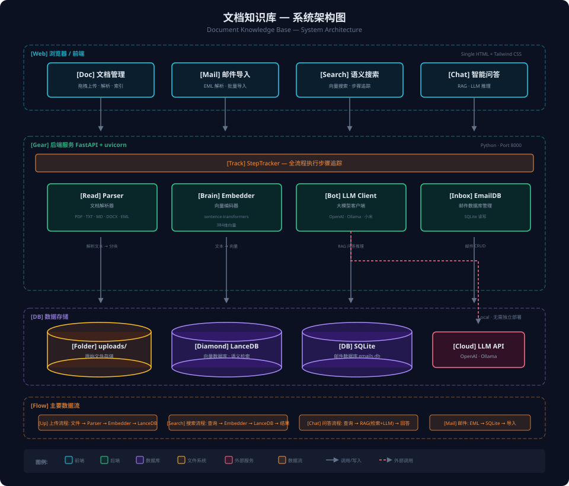

# 文档知识库

基于 LanceDB 的智能知识库系统 —— 文档、邮件、代码三合一的 RAG 参考实现。

<p align="center">
  
</p>

> **项目定位**：一套代码完整、可直接运行的知识库系统。支持 **文档/邮件/代码** 三种数据源，涵盖 **解析 → 向量化 → 语义检索 → RAG 问答 → MCP 工具暴露** 全链路。代码结构清晰、模块解耦，适合在此基础上进行二次开发。

## 功能特性

- 📄 **文档管理**: 拖拽上传 PDF/TXT/MD/DOCX/EML，自动解析、分块、向量化
- 📧 **邮件导入**: 从本地邮件数据库导入邮件，支持批量处理和搜索
- 💻 **代码知识库**: tree-sitter AST 解析 15+ 种语言，混合搜索（向量+关键词 RRF 融合），调用图追踪（BFS 多跳调用链）
- 🔍 **语义搜索**: 基于向量相似度的智能搜索，展示完整执行流程
- 💬 **智能问答**: RAG 架构，基于知识库内容回答问题，附带来源引用
- 🔌 **MCP 协议**: 暴露 AI 工具能力，Hermes/Claude 可直接调用代码搜索和问答
- 📦 **Skill 集成**: 配套 `code-search` skill（zip），封装 MCP 工具用法，Claude/Cursor/CodeMaker 一键接入
- 📊 **系统看板**: 文档/邮件统计、向量存储状态、性能数据可视化

## 适用场景

- 📖 **学习参考**: 了解 RAG 完整链路 —— Embedding → 向量检索 → LLM 推理
- 🔧 **二次开发**: 基于现成架构快速定制自己的知识库系统
- 🔬 **模型评测**: 对比不同 Embedding 模型、LLM、分块策略的实际效果
- 📚 **个人知识管理**: 搭建私有文档/代码库，支持语义搜索和智能问答
- 🤖 **AI 工具集成**: 通过 MCP 协议让 AI 助手直接搜索和理解你的代码

## 技术栈

| 层 | 技术 |
|----|------|
| Web 框架 | FastAPI + uvicorn |
| 向量数据库 | LanceDB（嵌入式，无需独立部署） |
| 关键词搜索 | SQLite FTS5（代码知识库） |
| Embedding | sentence-transformers（本地，384维，多语言） |
| 代码解析 | tree-sitter-language-pack（305+ 语言） |
| 邮件存储 | SQLite（`data/emails.db`） |
| LLM | OpenAI 兼容接口（默认小米 MiMo，支持 Ollama/OpenAI） |
| MCP | JSON-RPC 2.0 over SSE（手动实现，兼容 Python 3.9+） |
| 前端 | 单 HTML 文件 + Tailwind CSS（CDN） |

## 快速开始

### 1. 配置环境变量（可选，用于智能问答）

```bash
# 在 backend/ 目录下创建 .env 文件
LLM_PROVIDER=openai          # openai / ollama / xiaomi（默认）
LLM_API_KEY=your-api-key
LLM_BASE_URL=https://api.openai.com/v1
LLM_MODEL=gpt-3.5-turbo

# 本地 Ollama 示例
# LLM_PROVIDER=ollama
# LLM_MODEL=qwen2:7b
```

> **默认行为**：未配置时使用内置小米 MiMo（`llm_client.py` 中硬编码）。若无需问答功能，可跳过此步。

### 2. 启动服务

```bash
./start.sh
```

启动后访问: http://localhost:8000

> **首次启动**：脚本会自动创建 venv 并安装依赖，Embedding 模型（~90MB）也会在此时自动下载，需等待约 1-2 分钟。

### 3. 关闭服务

```bash
# 方式一：在前台运行时按 Ctrl+C 即可停止

# 方式二：若在后台运行，通过端口号 kill
lsof -ti:8000 | xargs kill

# 方式三：通过进程名 kill
kill $(pgrep -f "uvicorn main:app")
```

## 使用指南

### 📄 文档管理

1. 切换到"📄 文档管理"标签
2. 拖拽或点击上传文档（支持 PDF / TXT / MD / DOCX / EML）
3. 系统自动解析、分块、向量化并存入 LanceDB
4. 在搜索框输入问题，搜索相关文档内容

### 📧 邮件导入

1. 切换到"📧 邮件导入"标签
2. 选择导入数量
3. 点击"开始导入"
4. 查看导入进度和步骤详情

### 💻 代码知识库

1. 切换到"💻 代码知识库"标签
2. 左列填写仓库名、本地路径、项目类型，点击"开始扫描"
3. 等待扫描完成（约 3-5 分钟，取决于仓库大小）
4. 在搜索框输入关键词，选择搜索模式：
   - **混合**（默认）：向量 + 关键词 RRF 融合，综合效果最好
   - **语义**：纯向量搜索，适合搜"怎么实现的"这类问题
   - **关键词**：纯 FTS5 搜索，适合搜符号名（如 `markRead`）
5. 使用过滤器按仓库、语言、代码块类型缩小范围
6. 底部问答区可输入问题，基于代码库进行 RAG 回答

### 🔌 MCP 连接（给 AI 助手用）

在 `~/.hermes/config.yaml` 中添加：

```yaml
mcp_servers:
  code-kb:
    url: http://localhost:8000/mcp/sse
```

重启 Hermes 后自动注册 5 个工具：
- `mcp_code-kb_code_search` — 搜索代码库
- `mcp_code-kb_code_chat` — RAG 代码问答
- `mcp_code-kb_code_list_repos` — 列出已索引仓库
- `mcp_code-kb_code_file_context` — 获取文件上下文
- `mcp_code-kb_code_trace` — 追踪调用链（谁调了它 / 它调了谁）

> v2.0 起 MCP 端点已切换为 `/mcp/`（Streamable HTTP，mcp SDK v1.x），同时前端「🤖 Agent 接入」页内置 5 个子 tab 引导接入。

### 📦 Skill 集成（给 Claude/Cursor/CodeMaker 用）

除 MCP 外，本项目还提供 `code-search` skill（zip 包），把 MCP 工具调用流程封装成 AI Agent 友好的"使用说明书"。Agent 装上后**自动学会**怎么调上面的 5 个 MCP 工具。

**下载方式**（前端「🤖 Agent 接入 → Skill 接入 → 下载」）：
```bash
curl -O http://localhost:8000/api/skill/download
# 得到 code-search.zip（3 文件 / ~16KB，deflate 压缩后实测）
```

**安装方式**（前端页面给了 Claude Code / Cursor / CodeMaker / OpenCode 4 种命令）：
```bash
# Claude Code
mkdir -p ~/.agents/skills/code-search && unzip ~/Downloads/code-search.zip -d ~/.agents/skills/

# Cursor
mkdir -p ~/.cursor/skills/code-search && unzip ~/Downloads/code-search.zip -d ~/.cursor/skills/

# CodeMaker
mkdir -p ~/.codemaker/skills/code-search && unzip ~/Downloads/code-search.zip -d ~/.codemaker/skills/

# OpenCode
mkdir -p ~/.config/opencode/skill/code-search && unzip ~/Downloads/code-search.zip -d ~/.config/opencode/skill/
```

**后端端点**：
| 端点 | 说明 |
|------|------|
| `/api/skill/raw` | SKILL.md 全文 + 关联文件列表 |
| `/api/skill/info` | 文件清单（name/size）+ 总大小 |
| `/api/skill/commands` | AST 解析 `kb_api.py` 出的子命令（search/chat/trace/file/repos...） |
| `/api/skill/download` | 下载 `code-search.zip`（含 SKILL.md / README.md / scripts/kb_api.py） |

> 与 MCP 的关系：MCP 是"工具调用通道"，Skill 是"工具使用说明书"。两者**正交互补** —— Skill 教 AI 怎么用 MCP 工具调用代码知识库。

## 💻 代码知识库（详细）

### 支持的语言

| 语言 | 扩展名 | AST 解析 | 项目类型 |
|------|--------|----------|----------|
| Objective-C | .m, .h | ✅ class_interface/implementation/protocol | ios |
| Swift | .swift | ✅ class/protocol/extension/function | ios, macos |
| Java | .java | ✅ class/interface/method | android |
| Kotlin | .kt, .kts | ✅ class/function/object | android, kmp |
| Dart | .dart | ✅ class/mixin/function | flutter |
| C/C++/ObjC++ | .cpp, .cc, .c, .mm, .hpp | ✅ class/struct/function | macos |

### 分块策略

| 文件大小 | 策略 |
|----------|------|
| < 500 字符 | 整文件一个 chunk |
| 有结构的文件 | 按 AST 顶层符号（类/函数/协议）拆分 |
| 超长符号 > 1000 字符 | 按 500 字符二次切分（按行边界） |
| AST 解析失败 | 降级为整文件 chunk，标记 `parse_warning` |

### 存储架构

```
LanceDB (code_chunks)     ← 向量检索（语义搜索）
SQLite FTS5 (code_fts)    ← 关键词检索（符号名/路径精确搜索）
SQLite (code_meta)        ← 结构化过滤和统计
SQLite (code_relations)   ← 调用关系表（call graph，支持 BFS 多跳追踪）
code_repos.json           ← 仓库配置 + 文件 mtime（增量扫描）
```

### 增量扫描

基于文件 `mtime` 实现增量更新：
- **新增文件**：全量解析 + 写入
- **已修改文件**：删除旧 chunks + 重新解析写入
- **未变化文件**：跳过
- **已删除文件**：删除对应 chunks

全量刷新使用 `/api/code/repos/{name}/refresh` 接口。

### 搜索融合（RRF）

```
用户查询
  ├── 向量搜索 (LanceDB cosine)  ──┐
  └── 关键词搜索 (SQLite FTS5)   ──┤
                                    ▼
                              RRF 融合排序 (k=60)
                                    ▼
                              返回 Top-K 结果
```

同一 chunk 在两路都命中时 RRF 分数相加，最终按融合分数排序。

### 调用图追踪（code_trace）

```
用户查询（符号名或搜索关键词）
  ├── 混合搜索定位入口符号 ────────────┐
  └── code_relations 反向索引查找 ─────┤
                                       ▼
                              trace_chain BFS 多跳追踪
                              (direction: callers/callees/both, depth: 1-3)
                                       ▼
                              返回调用图（节点 + 边 + 直接调用者/被调用者）
```

Agent 通过 `code_trace` 可自动理清跨文件业务链路：
> "支付流程: OrderVC.submitOrder() → PaymentService.processPayment: → APIClient.sendRequest:completion: → handleResponse: 回调更新 UI"

## 技术架构

<p align="center">
  
</p>

## API 接口

### 文档 & 邮件

| 方法 | 路径 | 说明 |
|------|------|------|
| POST | /api/upload | 上传文档 |
| POST | /api/search | 向量搜索（带步骤追踪） |
| POST | /api/chat | 智能问答（RAG） |
| POST | /api/emails/import | 导入邮件 |
| GET | /api/documents | 文档列表 |
| GET | /api/emails | 邮件列表 |
| GET | /api/emails/search | 搜索邮件 |
| DELETE | /api/documents/{filename} | 删除文档 |
| GET | /api/stats | 统计信息 |

### 代码知识库

| 方法 | 路径 | 说明 |
|------|------|------|
| POST | /api/code/scan | 增量扫描目录，建立代码索引 |
| POST | /api/code/search | 混合搜索（向量+关键词，支持语义/关键词/混合模式） |
| POST | /api/code/chat | RAG 代码问答（需 LLM） |
| GET | /api/code/repos | 已索引的仓库列表 |
| GET | /api/code/stats | 索引统计信息 |
| DELETE | /api/code/repos/{name} | 删除仓库索引 |
| POST | /api/code/repos/{name}/refresh | 全量刷新仓库索引（幂等） |
| POST | /api/code/trace | 调用链追踪（symbol + direction + depth） |

### MCP 端点

| 端点 | 说明 |
|------|------|
| GET /mcp/sse | MCP SSE 传输端点（AI 工具连接入口） |
| POST /mcp/message | MCP 消息端点（JSON-RPC 请求） |

完整 API 文档请参考 [docs/code-kb-api.md](docs/code-kb-api.md)。

## 项目结构

```
email-wiki-demo/
├── backend/
│   ├── main.py              # FastAPI 主入口（路由 + 请求处理）
│   ├── parser.py            # 文档解析器（PDF/TXT/MD/DOCX/EML）
│   ├── embedder.py          # Embedding 封装（sentence-transformers）
│   ├── db.py                # LanceDB 文档向量库操作
│   ├── email_db.py          # SQLite 邮件数据库操作
│   ├── email_parser.py      # 邮件解析转换
│   ├── llm_client.py        # LLM 客户端（OpenAI/Ollama/小米）
│   ├── code_parser.py       # 代码解析器（tree-sitter AST + 混合分块 + 调用关系提取）
│   ├── code_db.py           # 代码存储层（LanceDB + SQLite FTS5 + code_relations 调用图）
│   ├── code_search.py       # 代码搜索层（混合搜索 + RRF 融合 + trace_code 调用链追踪）
│   ├── code_routes.py       # 代码知识库 REST API 路由（含 /api/code/trace）
│   ├── code_mcp_v2.py       # MCP Server v2（5 tools + Streamable HTTP，mcp SDK v1.12.4）
│   ├── code_config.py       # 代码仓库配置管理（增量扫描）               ← 新增
│   ├── match_reasons.py     # 搜索匹配原因分析
│   ├── metrics_db.py        # 性能指标数据库
│   ├── step_tracker.py      # 全流程执行步骤追踪
│   └── requirements.txt
├── frontend/
│   └── index.html           # 单页前端（全部交互，含代码知识库 tab）
├── docs/
│   ├── code-knowledge-base-design.md  # 代码知识库设计文档
│   ├── code-kb-api.md                 # API 参考文档
│   └── code-kb-progress.md            # 开发进度
├── start.sh                 # 一键启动脚本
├── data/                    # 数据库目录（自动生成，gitignore）
├── models/                  # 模型缓存目录（自动下载，gitignore）
└── README.md
```

## 二次开发指引

| 需求 | 改哪里 |
|------|--------|
| 替换 Embedding 模型 | `embedder.py` — `MODEL_NAME` 常量改为其他 sentence-transformers 模型 |
| 更换 LLM | `llm_client.py` — 按接口规范接入新模型 |
| 增加文档格式支持 | `parser.py` — 添加 `read_xxx()` 函数并注册到 `read_file()` |
| 自定义文档分块策略 | `parser.py` — 修改 `chunk_text()` 函数 |
| 增加代码语言支持 | `code_parser.py` — 在 `EXTENSION_MAP` 和 `SYMBOL_NODE_TYPES` 中添加映射 |
| 自定义代码分块策略 | `code_parser.py` — 修改 `chunk_code()` 函数 |
| 修改搜索融合算法 | `code_search.py` — 修改 `rrf_fusion()` 函数 |
| 修改前端界面 | `index.html` — 单个 HTML 文件 |
| 接入其他向量数据库 | `db.py` / `code_db.py` — 替换 LanceDB 调用 |
| 扩展 MCP 工具 | `code_mcp_v2.py` — 添加 `@mcp.tool()` 装饰器函数（v2.0 起替换 v1 旧 SSE 端点） |
| 扩展调用关系追踪 | `code_parser.py` — `_extract_call_name()` 添加新语言；`code_db.py` — 调整 `trace_chain()` 遍历策略 |

## 核心流程

```
文档知识库:
  上传文档 → Parser 解析 → Chunk 分块 → Embedder 向量化 → LanceDB 存储
  用户搜索 → Embedder 编码查询 → LanceDB 向量检索 → 匹配结果排序 → 前端展现

代码知识库:
  扫描目录 → tree-sitter AST 解析 → 混合分块 + 调用关系提取 → Embedder 向量化 → LanceDB + SQLite FTS5 + code_relations 三写
  用户搜索 → Embedder + FTS5 双路检索 → RRF 融合排序 → 前端展现
  调用链追踪 → 混搜定位符号 → code_relations BFS 多跳追踪 → 返回调用图
  代码问答 → 混合搜索 Top-K → 构建 Prompt → LLM 推理 → 返回答案 + 引用源

MCP 工具链:
  AI 助手 → SSE 连接 → JSON-RPC → code_search/code_chat → 返回结果
```

## 环境变量说明

| 变量 | 说明 | 默认值 |
|------|------|--------|
| LLM_PROVIDER | LLM 提供商 | openai |
| LLM_API_KEY | API 密钥 | - |
| LLM_BASE_URL | API 地址 | https://api.openai.com/v1 |
| LLM_MODEL | 模型名称 | gpt-3.5-turbo |

## 常见问题

**Q: 如何使用本地 LLM？**
A: 安装 Ollama，设置 `LLM_PROVIDER=ollama` 和 `LLM_MODEL=qwen2:7b`

**Q: 邮件数据从哪来？**
A: 系统会在首次启动时自动生成 50 封示例邮件（SQLite 为空时触发），覆盖 8 个模拟发件人和 INBOX/Sent/Drafts 文件夹。

**Q: 搜索结果不准确？**
A: 文档搜索：尝试调整返回数量、切换文件类型过滤。代码搜索：尝试切换搜索模式（混合/语义/关键词），关键词模式对符号名搜索更准确。

**Q: 代码扫描很慢？**
A: 首次全量扫描约 3-5 分钟（~7500 文件）。后续扫描基于 mtime 增量更新，只处理变化的文件，速度很快。

**Q: ObjC 代码 parse_warnings 很多？**
A: tree-sitter 对 ObjC 宏（`#define`、`#pragma`）支持有限，包含大量宏的文件会降级为整文件 chunk。功能不受影响，搜索精度略降。

**Q: 首次启动卡住？**
A: 正在下载 sentence-transformers 模型（~90MB），属正常现象，等待即可。后续启动不再重复下载。

**Q: MCP 连接不上？**
A: 确认服务已启动（http://localhost:8000），检查 `config.yaml` 中 URL 是否正确。MCP 使用 SSE 长连接，确保网络没有中间代理中断。
