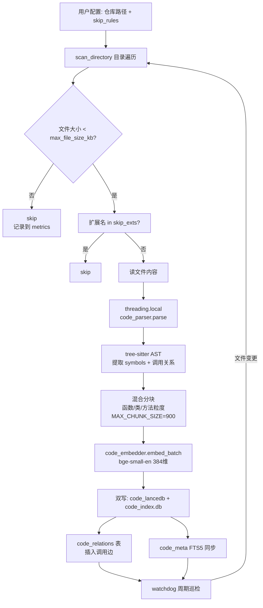
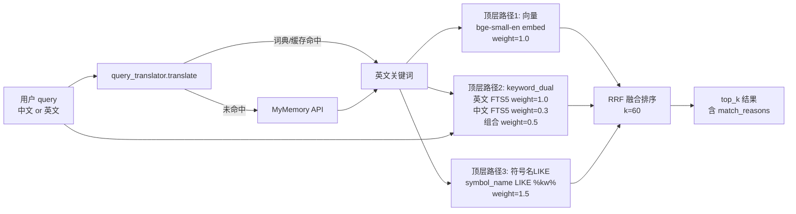
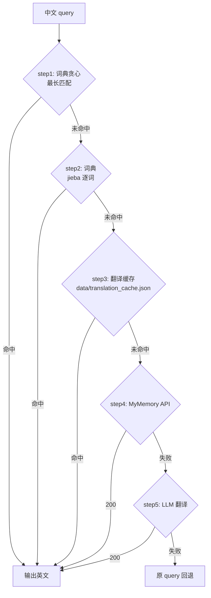
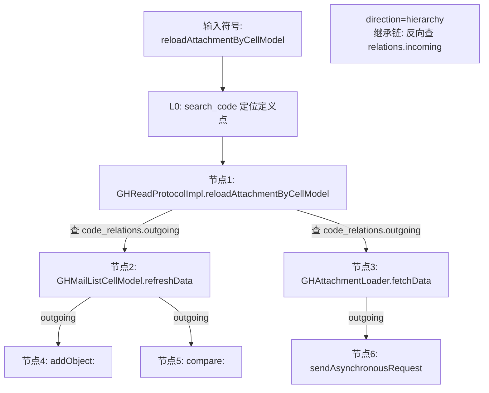
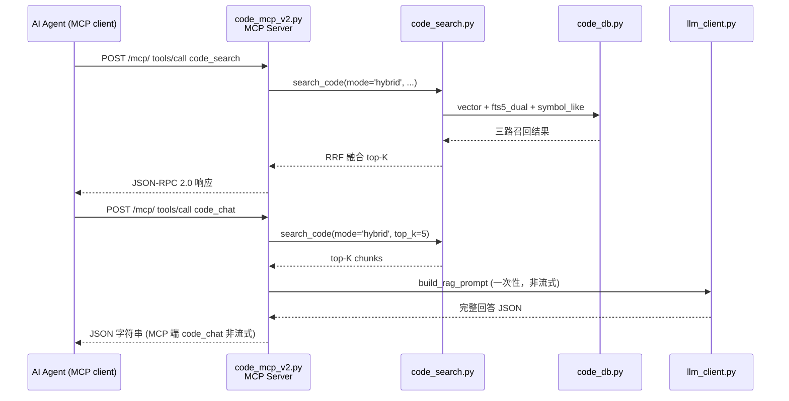

# 代码知识库「技术架构」tab — 设计文档

> 日期：2026-06-12
> 作者：柳哥（脑暴） + Claude（落地） + Codex（review）
> 状态：Draft，待柳哥最终 review

## 1. 目标与背景

### 1.1 问题
当前 11 个 tab 全部是**操作型**（上传/搜索/问答/统计/浏览器），没有任何一个 tab 是**关于项目本身技术实现的说明**。新读者进项目：
- 看完「代码仓库」扫了一遍，不清楚背后是 tree-sitter AST 还是字符串切块
- 看完「代码搜索」发现"中文查英文代码"居然能用，不理解为什么混搜能命中
- 看完「MCP 接入」看到 5 个 tools，不理解 trace 怎么 BFS 跨文件追踪

CLAUDE.md 写了完整的技术描述，但**是文字版**。读者进项目的第一接触面是 tab，需要一个"图文版"。

### 1.2 目标
- 在侧边栏加一个「技术架构」tab
- 用**流程图 + 关键模块详解 + 原理演示**三件套，把代码知识库的"扫描仓库怎么做"和"搜索怎么匹配"讲透
- 把现有 `code-lancedb.html` 的 C 区"原理演示"搬过来并扩展（基础 2 个 + 顶层 3 路混搜可视化）
- 让读者**看一遍就知道**：从代码扫描到顶层 3 路混搜的每一步、为什么这么设计、能调什么参数

### 1.3 范围边界
- **本 tab 范围** = 代码知识库（扫描 / 搜索 / MCP / 设计决策 / 演示）
- **不在本 tab 范围** = 文档知识管理、邮件导入、性能监控、LanceDB 浏览器、配置/日志/指标运维
  - 文档/邮件 tab 自己有演示页（`doc-lancedb.html:145`、`code-lancedb.html:163`）
  - 性能/日志是运维向，单独再考虑是否要加 tab（不在本次范围）

## 2. 决策记录

| # | 决策点 | 选择 | 理由 |
|---|--------|------|------|
| D1 | tab 范围 | 仅代码知识库 | 柳哥指定（避开与文档/邮件 tab 重复）|
| D2 | 内部结构 | 1 个 tab + 5 分区折叠 | 跟现有 11 tab 惯例 + `code-lancedb.html` A/B/C 区模式保持一致 |
| D3 | 内容深度 | 详版 | 柳哥原话"每个步骤越详细越好"；tab 价值在"图 > 字" |
| D4 | 演示区内容 | 基础 2 + 顶层 3 路可视化（共 3 卡）| 配合"可读性+关联性"原则；trace BFS 文字图说清楚，不重复演示 |
| D5 | 侧边栏位置 | 代码知识库组最后（"MCP 接入"之后）| 实操完看架构路径最短；不新建分组（YAGNI）|
| D6 | 流程图画法 | Mermaid.js 走 vendor | 改图改源码即可；跟 `vendor/js/tailwindcss.js` 同款本地运行时哲学 |
| D7 | 分区默认状态 | 默认全部展开 | 读者第一眼看到全貌；折叠按钮用于"看累了折叠省屏幕" |
| D8 | 跟 CLAUDE.md 关系 | tab 是 CLAUDE.md 的"图文版"，不是替代品 | tab 加跳转/链接指向 CLAUDE.md 章节作为 SSOT；改动任何一处都要同步另一处 |
| D9 | 演示 3 端点实现 | 绕开 `search_code` 顶层调底层 3 方法 | 不污染 search_code 接口；端点独立维护，未来 search_code 重构不影响 |
| D10 | 混搜架构图描述 | 画代码真实现状（顶层 3 路 + keyword 内 EN/CN 子双路）| 旧 4 路 A/B/C/D=1.0/1.0/0.3/1.5 是 CLAUDE.md 旧描述；代码现状是顶层 `vector/keyword_dual/symbol_like=1.0/0.5/1.5` |
| D11 | `_PARSER_CACHE` 现状 | tab A 区如实写"仍为模块级 dict" | 不藏雷（`coding-design-principles.md` 案例 4 教训）|

## 3. 架构

### 3.1 路由
- `router.js:24`（`code/mcp` 之后）新增：
  ```js
  "code/arch": { file: "tabs/code-arch.html", title: "技术架构", init: "initCodeArch" },
  ```

### 3.2 侧边栏
- `index.html:50`（MCP 接入项后）新增：
  ```html
  <a class="sidebar-item" data-route="code/arch" href="#code/arch">🧭 <span>技术架构</span></a>
  ```

### 3.3 资源
- `index.html:14-16` CSS 区域追加（theme.css 之后）：`<link rel="stylesheet" href="vendor/css/mermaid.css">`（按需）
- `index.html:212-217` JS 区域追加（router.js 之后）：
  ```html
  <script src="vendor/js/mermaid.min.js"></script>
  <script>
    // mermaid vendor 加载就绪后初始化
    window.initMermaid = function() {
      if (window.mermaid) {
        window.mermaid.initialize({
          startOnLoad: false,
          theme: 'dark',
          securityLevel: 'loose',
          themeVariables: {
            fontFamily: 'ui-monospace, SFMono-Regular, Menlo, monospace',
          },
        });
      }
    };
    // 等待 mermaid 加载
    if (window.mermaid) { initMermaid(); }
    else { document.addEventListener('DOMContentLoaded', initMermaid); }
  </script>
  ```
- **vendor 加载**：Mermaid 10.x minified ≈ 200KB（MIT 协议），下载到 `frontend/vendor/js/mermaid.min.js`
- `__TAB_VERSION` 从 `'24'` → `'25'`（按 `rules/development/frontend-development.md` 必做）

### 3.4 tab 文件结构

```
frontend/tabs/code-arch.html      # 主文件，5 分区折叠骨架 + Mermaid 源码 + 演示卡
```

无需独立 JS（init 函数 + 演示逻辑 + mermaid.run 渲染都内嵌在 `<script>` 标签里，跟 `code-lancedb.html` 风格一致）。

## 4. 5 分区内容设计

### 4.1 A 区 — 🏗️ 仓库扫描流程

**目的**：让读者看完知道"扫描一个目录从入口到落库每一步做什么"。

#### A.1 流程图（Mermaid）


#### A.2 关键模块详解
| 模块 | 文件:行 | 做什么 | 关键参数/坑 |
|------|---------|--------|------------|
| 目录遍历 | `code_parser.py:673` `scan_directory` | 递归 walk + 应用 skip_rules | **已知风险**：跨线程共享 parser 仍用模块级 `_PARSER_CACHE: dict`（`code_parser.py:132`）—— CLAUDE.md 描述的 `threading.local()` 改造**尚未落地**；后续 push 前如发现 panic 再修 |
| tree-sitter AST | `code_parser.py:1249` `parse_repo` | 解析多语言（Py/JS/TS/Java/Go/Rust/C++/Swift/OC）| tree-sitter 0.25.x 兼容层（**修过**：API 变更）|
| 混合分块 | `code_parser.py:_sub_chunk` (`:941`)、分块逻辑 `:1069-1193` | AST 节点优先；超大节点二次切分 | `MAX_CHUNK_SIZE=900`（避免 embedding 截断）、`SUB_CHUNK_SIZE=500`；`<500` 短文件直存，`>900` 二次切分 |
| Embedding | `code_embedder.py:embed_batch` | bge-small-en 384维 | 单例预加载；启动时下载到 `models/` |
| 双写 | `code_db.py:insert_chunks` | LanceDB（向量）+ SQLite FTS5（content/symbol_name）| FTS5 索引分词器 unicode61 + 触发器维护 |
| 跳过规则 | `code_skip_rules.py` | skip_dirs / skip_exts / max_file_size_kb | 配置文件 `config/code_skip_rules.json`（**注意**：CLAUDE.md 写 `data/`，实际是 `config/`，本 tab 用真实路径）；**修过**：原 100KB 硬编码 → 默认 250KB 配置化 |
| Watchdog | `code_routes.py:watchdog_loop` | 周期扫描 `code_repos.json` 标记的仓 | 配置在 `config/code_repos.json` 的 `watchdog` 段（interval=30s）|
| 调用关系 | `code_db.py:insert_relations` | 边表：caller → callee | 来源是 AST 的 `(call_node, function_def_node)` 配对 |
| 扫描入口端点 | `code_routes.py:447` `scan_repo_endpoint` | POST `/api/code/scan` | 启 scan_id，触发 `scan_directory` |
| 进度推送 | `code_routes.py:478` `scan_progress_sse` | GET `/api/code/scan/{scan_id}/sse` | SSE 流式推 progress |
| 取消扫描 | `code_routes.py:543` `cancel_scan` | POST `/api/code/scan/{scan_id}/cancel` | 设置 cancel_event，线程协作退出 |

#### A.3 数据落地（ASCII + 代码引用）
```
扫描入口：POST /api/code/scan  (code_routes.py:447 scan_repo_endpoint)
   ↓
进度推送：GET /api/code/scan/{scan_id}/sse  (code_routes.py:478 scan_progress_sse)
   ↓
取消机制：POST /api/code/scan/{scan_id}/cancel  (code_routes.py:543 cancel_scan)
   ↓
数据落盘：
  config/code_repos.json     ← 仓库元信息 + watchdog 配置
  data/code_lancedb/         ← LanceDB 向量
  data/code_index.db         ← SQLite FTS5 + code_relations
```

### 4.2 B 区 — 🔍 搜索匹配架构

**目的**：让读者看懂"顶层 3 路怎么召回 + 翻译层怎么把中文翻成英文 + trace 怎么跨文件追踪"。

#### B.1 混搜架构图（Mermaid，画代码真实现状：顶层 3 路 + keyword 内 EN/CN 子双路）


#### B.2 混搜对比表（**反映代码真实现状**：顶层 3 路 + keyword 内 EN/CN 子双路）
| 层 | 路径 | 方法 | 输入 | 角色 | 权重 | 实际效果 |
|----|------|------|------|------|------|---------|
| 顶层 1 | A | bge-small-en (384维) 向量搜索 | 翻译后英文 | 语义模糊召回 | 1.0 | 同语言英文→英文代码 |
| 顶层 2 | A2 (EN) | SQLite FTS5 + jieba | 翻译后英文 | 英文 content/symbol 精确匹配 | 子权重 1.0 | 英文关键词直接命中 |
| 顶层 2 | A3 (CN) | SQLite FTS5 + jieba | 中文原 query | 中文 content 弱信号 | 子权重 0.3 | 搜中文注释/文档 |
| 顶层 2 (合并) | keyword_dual | RRF 融合 A2 + A3 | — | 关键词召回合并 | **0.5** | keyword 路总权重（EN/CN 内部 rrf_fusion）|
| 顶层 3 | D | `symbol_name LIKE %kw%` | 翻译后英文 + 驼峰拆词 | 精确命中 | 1.5 | **最可靠**，兜底 FTS5 驼峰拆分盲区 |

代码参考：`code_search.py:307`（keyword 内部 EN/CN 双路权重 `[1.0, 0.3]`）、`code_search.py:519`（顶层三路 RRF 融合权重 `[1.0, 0.5, 1.5]`）。

> **与 CLAUDE.md 差异说明**：CLAUDE.md "代码搜索准确率策略" 节描述的是早期"4 路平铺"模型，代码后续重构为"顶层 3 路 + keyword 内 EN/CN 子双路"。本 tab 画代码真实现状，CLAUDE.md 待同步更新。

#### B.3 翻译层降级链（Mermaid）


降级链关键点：
- **MyMemory 翻译不写缓存**（**修过**：直译置信度低，写缓存会永久污染词典；见 `coding-design-principles.md` 案例 1）
- **词典优先于 API**（**验证过**："读信" → `read/mail/message` 命中 `ReadCell.m`；缺词典降级到 MyMemory 会译成 `letter/reading` 翻车）

#### B.4 调用链追踪（trace）BFS 多跳图（Mermaid）


关键设计：
- **正向 BFS**（`direction=callees`）：找"我调用了谁"
- **反向 BFS**（`direction=hierarchy`）：找"谁继承了我/谁调用了我"
- **深度限制**：默认 3 跳，可配；超过的边丢弃

#### B.5 关键代码引用（**示意代码**，落地时按真实行号重写）
```python
# 落地时引用 code_search.py 中真实行号，本 spec 给出的是简化后的关键逻辑
# 真实入口是 search_code(mode='hybrid')，见 code_search.py:320
def search_code(query, mode="hybrid", top_k=20, repo_name=None, language=None):
    # 翻译
    keywords = query_translator.translate(query)  # 走 B.3 降级链
    # 顶层 3 路召回
    vec_results = code_db.vector_search(keywords, top_k)  # 顶层 1
    kw_results  = _keyword_search_dual(keywords, query)   # 顶层 2，EN+CN 子双路
    like_results = code_db.symbol_like(keywords)            # 顶层 3
    # 顶层 RRF 融合（顶层权重 [1.0, 0.5, 1.5]）
    fused = rrf_fusion(
        [vec_results, kw_results, like_results],
        weights=[1.0, 0.5, 1.5],
        k=60,
    )
    return fused[:top_k]
```

### 4.3 C 区 — 🔌 MCP 协议层

**目的**：让读者看懂"AI Agent 调 `code_search` 一次，内部发生什么"。

#### C.1 MCP 5 tools 总览
| Tool | 入参 | 内部调用 | 返回 |
|------|------|---------|------|
| `code_search` | `query, repo, top_k, hybrid` | `code_search.search_code` | top-K chunks + match_reasons |
| `code_chat` | `question, repo, language`（MCP 入参名是 `question`）| `code_search.search_code` + `llm_client` | **非流式**返回完整 JSON 字符串（REST `/api/code/chat` 才支持流式 SSE）|
| `code_list_repos` | — | `code_db.list_repos` | 已索引仓库列表 |
| `code_file_context` | `repo, file_name` | `code_db.resolve_file_by_name` | 单文件所有 chunks（**v2.1 改造**：file_path → file_name）|
| `code_trace` | `repo, symbol, direction, depth` | `code_db.trace_chain` / `trace_hierarchy` | BFS 调用链 / 继承链 |

#### C.2 Streamable HTTP 链路（Mermaid）


> **注意 MCP 与 REST 差异**：流式 SSE 仅在 REST 端点 `POST /api/code/chat` 才有；MCP tool `code_chat` 入参是 `question: str`（不是 `query`），且**非流式**返回完整 JSON 字符串（`code_mcp_v2.py:62`）。tab C 区描述以 MCP 为准，REST 流式能力放到 C.3 旁注。

#### C.3 e2e 真实 query 链路
示例：Agent 收到用户问"代码里怎么读取附件"——
1. Agent 调 `code_search(query="读附件", repo="ghmail")`
2. MCP 走 B 区混搜：翻译"读附件"→`read attachment`，走顶层 3 路（vector/keyword_dual/symbol_like），命中 `GHAttachmentLoader.m`、`GHReadProtocolImpl.m`
3. Agent 拿 top-3 chunks，再调 `code_file_context(repo="ghmail", file_name="GHAttachmentLoader.m")` 看完整文件
4. Agent 调 `code_trace(repo="ghmail", symbol="GHAttachmentLoader.fetchData", direction="callees", depth=2)` 看下游调用
5. Agent 用上面所有上下文调 **MCP** `code_chat(question="详细说明", repo="ghmail")` 拿到**非流式 JSON 回答**；如需流式，改调 **REST** `POST /api/code/chat`（`stream: true`）

### 4.4 D 区 — 📐 关键设计决策

**目的**：把 CLAUDE.md 里那张"实验结论"表**画成图文版**，让读者理解"为什么这样设计、试过哪些别的方案、结论是什么"。

#### D.1 设计决策表（CLAUDE.md 那张表 + 图文佐证）
| 决策 | 结论 | 证据 | 图/示意 |
|------|------|------|---------|
| 跨语言 embedding（e5/bge-m3）代替翻译层 | ❌ | 中文 query → 纯英文 OC 代码召回接近随机 | 跨语言桥训练于平行语料非代码 |
| 词典是第一道防线 | ✅ | "读信"→read/mail/message 命中 `ReadCell.m` | 缺词典降级 MyMemory 译成 letter/reading 翻车 |
| Embedding 前剥离注释/中文字面量 | ✅ | 剥离后向量路不再偏到中文噪声 | embedding 输入清洗前后对比示意 |
| MyMemory 翻译不写入缓存/词典 | ✅ | 直译置信度低，写缓存永久污染 | 翻译层降级链图（B.3）|
| 向量阈值 0.0→0.5 | ✅ | score = (1+余弦相似度)/2，0.5=正交分界 | 阈值过低召回噪声示例 |
| 文档侧保持 bge-base-zh-v1.5 | ✅ | 同语言中文→中文，换多语言降低中文单项质量 | 不替换示意 |
| **混搜架构重构**：CLAUDE.md 旧 4 路 A/B/C/D → 顶层 3 路 vector/keyword_dual/symbol_like（keyword 内 EN/CN 子双路 1.0/0.3）| ✅ 已落地 | 旧 4 路模型融合时 keyword 路被中文噪声带偏；keyword 内 EN/CN 子双路 + 顶层三路让权重可调 | 本 tab B.1/B.2 画代码真实现状；CLAUDE.md 同步更新 |

#### D.2 反例存档（链接到 CLAUDE.md）
- **案例 1**：PushService deviceToken 并发修复（2026-05-27，ghmail）— 减法思维经典
- **案例 2**：MCP 测试示例 file_path "README.md 必有" 翻车（2026-06-12）— 不查数据源拍脑袋
- **案例 3**：file_path 改 file_name（2026-06-12 v2.1）— 减法+合并
- **案例 4**：MCP trace 召回翻车 — 100KB 硬编码 + parser 跨线程 panic（2026-06-12）— 硬编码数字阈值 + pyo3 线程安全

每条用折叠面板 `<details>` 收纳（默认折叠），避免 D 区太长。

### 4.5 E 区 — 🧪 原理演示

**目的**：让读者**点一下就看到**前面 A/B/C/D 区讲的流程在真实数据上怎么走。

#### E.1 三张演示卡
| 卡 | 标题 | 输入 | 后端调用 | 输出展示 |
|---|------|------|---------|---------|
| 演示 1 | 📥 存入演示（搬自 `code-lancedb.html` C 区）| 代码片段 + language + repo + file_path | `POST /api/code/lancedb/demo/insert`（**Sandbox 模式：不真实写库**，`code_routes.py:1221`）| StepTracker 步骤：AST 解析 → 分块（`MAX_CHUNK_SIZE=900`/`SUB_CHUNK_SIZE=500`）→ embedding → 假写入（`would_insert=true`）|
| 演示 2 | 🔍 搜索演示（搬自 `code-lancedb.html` C 区）| 查询词 + top_k + score_threshold | `POST /api/code/lancedb/demo/search`（**走真实 search_code 但 top_k 受限**，`code_routes.py:1322`）| StepTracker 步骤：翻译 → 向量召 → keyword_dual 召 → symbol_like 召 → RRF 融合 → top-K |
| 演示 3 | 🌐 混搜可视化（新增）| 查询词 | **新增** `POST /api/code/arch/hybrid-demo` | 3 张子卡片分别展示**顶层 3 路**（vector / keyword_dual / symbol_like）召回的 top-3 + 1 张 RRF 融合结果卡 |

> **演示 1 Sandbox 说明**：`/api/code/lancedb/demo/insert` 设计目的是"展示分块+向量化会发生什么"，**不真实写库**（不污染 `data/code_lancedb/` 和 `data/code_index.db`）。读者输入"垃圾代码片段"也不会污染真实数据。演示 2 走真实 `search_code` 端点，但只读不改。

#### E.2 演示 3 后端端点
- **路径**：`POST /api/code/arch/hybrid-demo` （新增）
- **位置**：`backend/code_routes.py`
- **入参**：`{"query": str, "repo": str, "top_k": int=5}`
- **repo 缺省策略**：若 `repo` 为空/null，从 `config/code_repos.json` 取**第一个有索引数据的 repo** 作 fallback
- **实现思路**（**D9 决策：绕开 `search_code` 顶层封装，直接调底层 3 个方法**）：
  - 不调用 `search_code(mode='hybrid')`，避免污染其接口
  - 端点内部按**顶层 3 路**分别调底层方法（`code_search.py` 模块级函数）：
    - 路径 1：向量 → `embed_text(query)` + `code_db.vector_search()`，取 top-3
    - 路径 2：keyword_dual → 翻译后调 `_keyword_search_dual()`（`code_search.py:266`），它内部再做 EN/CN 双路 rrf_fusion，取 top-3
    - 路径 3：symbol_like → `code_db.symbol_like(keywords)`，取 top-3
  - 最后再调 `search_code(mode='hybrid', top_k=top_k)` 拿 RRF 融合结果（用作演示卡第 4 张）
  - 这样**演示 3 跟 search_code 顶层接口解耦**，未来 search_code 重构不影响本端点
- **响应 schema**：
  ```json
  {
    "query": "读附件",
    "translated_keywords": ["read", "attachment"],
    "vector_path":     [{"file_path": "...", "content": "...", "score": 0.78}, ...],
    "keyword_dual_path":[
      {"file_path": "...", "content": "...", "rrf_score": 0.012, "from": "en_fts"},
      {"file_path": "...", "content": "...", "rrf_score": 0.008, "from": "cn_fts"}
    ],
    "symbol_like_path":[{"file_path": "...", "symbol_name": "...", "score": 1.0}, ...],
    "rrf_fused":       [{"file_path": "...", "content": "...", "rrf_score": 0.045}, ...]
  }
  ```

#### E.3 演示卡视觉
- 三卡横排（`lg:grid-cols-3`），每张卡跟 `code-lancedb.html` 的 C 区演示卡同款（深色 panel + 步骤折叠列表）
- 演示 3 输出用 4 个子 section（**3 路 + 1 融合**），用 `<details>` 折叠

## 5. 错误处理

| 场景 | 表现 | 处理 |
|------|------|------|
| Mermaid 渲染失败 | `console.error` 报错，图表不显示 | `<pre class="mermaid">` 源码回退显示（浏览器直接看到 Mermaid 源码），不阻塞 tab 其他内容 |
| 后端 `/api/code/arch/hybrid-demo` 500 | 演示 3 卡片显示错误提示 | 用 `try/catch` 包住 fetch，失败时显示 `err.message` + "重试" 按钮 |
| 用户未配置 code_repos | A/B/E 区扫描/搜索/演示可能无数据可演示 | 顶部显示提示条 "请先在'代码仓库' tab 添加仓库"（不阻塞 tab 打开）|
| Vendor mermaid.min.js 404 | Mermaid 渲染失败 | 在 `index.html:212-217` 区域加 `<script src="..." onerror="window.__MERMAID_LOAD_FAILED=true">` 检测；tab 内 Mermaid 块回退到 ASCII |
| __TAB_VERSION 未 bump | 用户改完 tab 不生效 | commit message 必带 `bump __TAB_VERSION=25`（按 `frontend-development.md`）|

## 6. 测试

### 6.1 端到端测试
- 启动服务 → 浏览器打开 `#code/arch` → 5 分区全部展开
- A/B/C 区所有 Mermaid 图表（**A.1 扫描流程 / B.1 混搜架构 / B.3 翻译层降级 / B.4 trace BFS / C.2 Streamable HTTP，共 5 张**）**渲染成功**（不是回退到源码）
- E 区演示 1：输入 `def hello():\n    print("hi")`，点执行，5 步内完成（**Sandbox 不写库**，仅展示分块+向量化）
- E 区演示 2：输入 `读附件`，点执行，返回 top-5 chunks（**走真实 search_code 但只读不改**）
- E 区演示 3：输入 `reloadAttachmentByCellModel`，**3 张子卡（vector/keyword_dual/symbol_like）+ 1 融合卡**都返回数据

### 6.2 回归
- 现有 11 个 tab 路由不破
- 侧边栏 12 个 tab 顺序：文档组（5）+ 代码组（7）
- `__TAB_VERSION=25` 生效后，用户**硬刷新**浏览器（Cmd+Shift+R）能拿到新 tab

### 6.3 验证清单（提交前自检）
- [ ] `frontend/vendor/js/mermaid.min.js` 存在（~200KB，MIT 协议）
- [ ] `frontend/tabs/code-arch.html` 创建
- [ ] `frontend/js/router.js:24` 之后追加 1 行路由
- [ ] `frontend/index.html:50` 之后追加 1 个侧边栏项
- [ ] `frontend/index.html:314` `__TAB_VERSION` 从 `'24'` 改为 `'25'`
- [ ] 浏览器打开 `#code/arch`，5 分区全展开
- [ ] 5 张 Mermaid 图全部渲染（A.1 扫描 / B.1 混搜 / B.3 翻译降级 / B.4 trace BFS / C.2 Streamable HTTP）
- [ ] 演示 1/2/3 在有 ghmail 索引时能跑通
- [ ] 演示 3 后端端点 `POST /api/code/arch/hybrid-demo` 实现并测试通过
- [ ] 硬刷新浏览器后新 tab 出现
- [ ] commit message 含 `bump __TAB_VERSION=25`

## 7. 实施步骤（概览）

1. 下载 Mermaid 10.x → `frontend/vendor/js/mermaid.min.js`
2. 创建 `frontend/tabs/code-arch.html`（5 分区骨架 + Mermaid 源码 + 演示卡）
3. `router.js` 加 1 行路由；`index.html:50` 加 1 个侧边栏项；`index.html:314` bump 版本号
4. `code_routes.py` 加 1 个端点 `POST /api/code/arch/hybrid-demo`
5. 端到端跑通：浏览器打开 → 5 区全展开 → 演示 1/2/3 跑通
6. commit（含 `bump __TAB_VERSION=25`）

## 8. 风险与已知限制

| 风险 | 缓解 |
|------|------|
| Mermaid vendor 文件 200KB 增大首屏 | 只在路由命中 `#code/arch` 时才执行 mermaid.run；不在 index.html 启动时自动渲染 |
| 演示 3 后端需要调用 3 路底层方法，可能漏字段 | 严格按 4.2 schema 写，每路返回字段名固定（`file_path`/`content`/`score`/`rrf_score`/`from`）|
| 详版 tab 体量大（5 区 + **5 张 Mermaid** + 3 演示卡）| 用 `lg:grid-cols` 多列 + `<details>` 折叠；首屏只展开 A/B 区，C/D/E 默认折叠，进来时滚动友好 |
| 改动 A/B 区文字描述后没同步 CLAUDE.md | commit message 加 `同步 CLAUDE.md`（如有改动）；CI 阶段加 grep 校验（不强制）|
| 详版会让 tab 滚动条很长 | D7 已对齐默认全展开；读者用各分区的折叠按钮自管（折叠交互见 3.4）|
| **`_PARSER_CACHE` 已知风险**：CLAUDE.md 描述的 `threading.local()` 改造**尚未落地** | tab A.2 标"已知风险"；后续 push 前如发现 panic 再修（参考 `coding-design-principles.md` 案例 4 教训）|

## 9. 不在本次范围（YAGNI）

- 把"原理演示"从 `code-lancedb.html` C 区**完全删除并只保留在新 tab**（柳哥没要求；保留兼容）
- 新增"翻译层"独立演示卡（D4 决策不做，4 个演示太长破坏可读性）
- 拆独立分组"📚 关于"放架构 tab（D5 决策不做，YAGNI）
- 加 Mermaid 暗色主题切换按钮（用默认 dark 主题就够）
- 加 D 区反例存档的"修复 commit hash"自动链接到 git log（手写链接到 commit 即可）

## 10. 后续

- commit 后跑 REGRESSION_TEST.md 补一条新用例
- 跑通后考虑是否要回 `code-lancedb.html` 移除 C 区演示卡（**不立即做**，留兼容）
- 长期看：其他 tab（doc-*）的"原理演示"是否要同样模式搬过来（**不在本次范围**）
